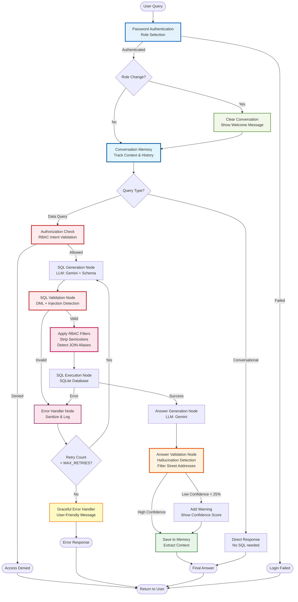

# 🏗️ System Architecture

**Property Management Chatbot - Technical Architecture**

---

## 📊 Architecture Diagram

**View the interactive diagram:** [docs/architecture_diagram.html](architecture_diagram.html)



---

## 🎯 System Overview

The Property Management Chatbot is built using a **ReAct (Reason + Act) pattern** implemented with **LangGraph**. It converts natural language queries into SQL, executes them securely, and provides validated answers while maintaining conversation context.

### **Core Components**

1. **Password Authentication** - Simple role-based login system
2. **LangGraph State Machine** - Orchestrates the complete query flow
3. **LLM (Google Gemini)** - Powers natural language understanding and SQL generation
4. **Conversation Memory** - Tracks context across interactions (last 10 turns)
5. **Answer Validation** - Prevents LLM hallucinations with confidence scoring
6. **RBAC Security Layer** - Intent validation with dynamic SQL filtering
7. **SQL Injection Prevention** - Multi-layer security validation
8. **Error Handling** - User-friendly error messages
9. **SQLite Database** - Property management data store

---

## 🔄 Query Flow

### **1. Query Reception**

```
User Query → PropertyManagementAgent.query()
```

**Input:**
- Natural language question
- User context (role, user_id, owner_id)

**State Initialization:**
```python
AgentState = {
    "messages": [],
    "user_context": UserContext,
    "user_query": str,
    "sql_query": None,
    "sql_result": None,
    "final_answer": None,
    "retry_count": 0,
    "error_log": [],
    "schema_metadata": dict,
    "validation_passed": bool,
    "confidence_score": float
}
```

---

### **2. Query Routing Node**

**Determines query type:**

```python
def _generate_sql_node(state):
    # Enhance with conversation memory
    enhanced_query = memory.enhance_query(user_query)
    
    # Check if data query or conversational
    is_data_query = security.is_data_query(enhanced_query)
    
    if not is_data_query:
        return conversational_response
    
    # Check authorization (RBAC)
    is_allowed = security.check_authorization(query, user_context)
    
    if not is_allowed:
        return access_denied
    
    # Generate SQL
    sql = llm.generate_sql(enhanced_query, schema)
    return sql
```

**Outputs:**
- Conversational response (non-data queries)
- Access denied (unauthorized)
- Generated SQL (authorized data queries)

---

### **3. SQL Validation Node**

**Validates generated SQL:**

```python
def _validate_sql_node(state):
    sql = state["sql_query"]
    
    # Check for DML operations
    if security.contains_dml(sql):
        return error("DML operations not allowed")
    
    # Apply RBAC filters
    if user_context.role == 'owner':
        sql = security.apply_rbac(sql, user_context.owner_id)
    
    return sql
```

**Security Checks:**
1. ❌ Block: INSERT, UPDATE, DELETE, DROP
2. ✅ Apply: Owner filtering (WHERE owner_id = X)

---

### **4. SQL Execution Node**

**Executes validated SQL:**

```python
def _execute_sql_node(state):
    try:
        result = db_manager.execute_query(state["sql_query"])
        return result
    except Exception as e:
        log_error(e)
        return None
```

**On Error:**
- Sanitize error message
- Log for retry
- Trigger error handler

---

### **5. Error Handler Node**

**Self-correction loop:**

```python
def _handle_error_node(state):
    state["retry_count"] += 1
    
    if state["retry_count"] < MAX_RETRIES:
        # Provide error context to LLM for regeneration
        return "retry"
    else:
    return "fail"
```

**Max Retries:** Configurable via `.env` (default: 3)

---

### **6. Answer Generation Node**

**Converts SQL results to natural language:**

```python
def _generate_answer_node(state):
    result = state["sql_result"]
    
    # Add conversation context
    context_prompt = memory.get_context_prompt()
    
    # Generate natural language answer
    answer = llm.generate_answer(
        query=state["user_query"],
        sql=state["sql_query"],
        result=result,
        context=context_prompt
    )
    
    return answer
```

**Context Enhancement:**
- Includes recent conversation topics
- References previous queries
- Maintains continuity

---

### **7. Answer Validation Node**

**Validates LLM answer against SQL results:**

```python
def validate_answer(state):
    sql_result = state["sql_result"]
    llm_answer = state["final_answer"]
    
    # Extract numbers from both
    sql_numbers = extract_sql_numbers(sql_result)
    answer_numbers = extract_numbers(llm_answer)
    
    # Compare with tolerance
    is_valid = all_numbers_match(sql_numbers, answer_numbers, tolerance=0.02)
    confidence = calculate_confidence(match_ratio)
    
    if not is_valid:
        warning = format_warning(sql_numbers, answer_numbers)
        answer = add_warning(llm_answer, warning, confidence)
    
    return answer, is_valid, confidence
```

**Validation Features:**
- Number extraction (handles $, commas, decimals)
- Fuzzy matching (2% tolerance)
- Confidence scoring
- Warning messages

---

### **8. Memory Storage**

**Save interaction to memory:**

```python
def save_to_memory(state):
    memory.add_interaction(
        query=state["user_query"],
        sql_query=state["sql_query"],
        result=state["sql_result"],
        answer=state["final_answer"]
    )
    
    # Extract context for next query
    memory.update_context()
```

**Context Extraction:**
- Locations (states, cities)
- Property types
- Topics (rent, profitability, count)
- Owner references

---

## 🔐 Security Architecture

### **Multi-Layer Security**

```
┌─────────────────────────────────────┐
│  Layer 1: Authorization Check       │  ← RBAC Pre-validation
├─────────────────────────────────────┤
│  Layer 2: Prompt Engineering        │  ← LLM instruction
├─────────────────────────────────────┤
│  Layer 3: Regex Validation          │  ← DML detection
├─────────────────────────────────────┤
│  Layer 4: Query Modification        │  ← Owner filtering
├─────────────────────────────────────┤
│  Layer 5: Result Validation         │  ← Answer verification
└─────────────────────────────────────┘
```

### **Layer Details**

**Layer 1: Authorization Check**
```python
# Block unauthorized owner queries
if role == 'owner' and query_mentions_other_owner():
    return "Access denied"

# Block sensitive data for viewers
if role == 'viewer' and query_requests_details():
    return "Access denied"
```

**Layer 2: Prompt Engineering**
```
"You are a READ-ONLY assistant.
Never generate INSERT, UPDATE, DELETE, or DROP statements.
Only generate SELECT queries."
```

**Layer 3: Regex Validation**
```python
DML_PATTERNS = [
    r'\bINSERT\b', r'\bUPDATE\b',
    r'\bDELETE\b', r'\bDROP\b',
    r'\bALTER\b', r'\bCREATE\b'
]

if any(re.search(p, sql, re.I) for p in DML_PATTERNS):
    raise SecurityError("DML not allowed")
```

**Layer 4: Query Modification (RBAC)**
```python
if role == 'owner':
    # Append WHERE clause
    sql = add_owner_filter(sql, owner_id)
    # SELECT * FROM Properties
    # → SELECT * FROM Properties WHERE owner_id = 2
```

**Layer 5: Result Validation**
```python
# Ensure answer matches SQL results
if not validate_answer(sql_result, llm_answer):
    add_warning("Validation failed")
```

---

## 💾 Data Architecture

### **Database Schema**

```
Owners (6 rows)
  ├─ owner_id (PK)
  ├─ owner_name (LLC1-LLC6)
  ├─ contact_email
  └─ contact_phone
  
Properties (161 rows)
  ├─ property_id (PK)
  ├─ owner_id (FK → Owners)
  ├─ address, city, state, zip_code
  ├─ property_type
  ├─ purchase_date, purchase_price
  └─ is_active
  
Units (166 rows)
  ├─ unit_id (PK)
  ├─ property_id (FK → Properties)
  ├─ unit_number
  ├─ bedrooms, bathrooms, square_feet
  └─ monthly_rent
  
Leases (166 rows)
  ├─ lease_id (PK)
  ├─ unit_id (FK → Units)
  ├─ tenant_name
  ├─ start_date, end_date
  ├─ monthly_rent, security_deposit
  └─ is_active
```

### **Relationships**

```
1 Owner → Many Properties
1 Property → Many Units
1 Unit → Many Leases (historical)
```

---

## 🧠 Memory Architecture

### **ConversationMemory Structure**

```python
class ConversationMemory:
    history: List[ConversationTurn]  # Last 10 interactions
    current_context: Dict[str, str]  # Merged context
    max_history: int = 10
```

### **Context Tracking**

```
Interaction 1: "Properties in California"
  → Extract: {location: 'California', topic: 'properties'}

Interaction 2: "What's the average rent?"
  → Merge: {location: 'California', topic: 'rent'}

Interaction 3: "What about Arizona?"
  → Replace location: {location: 'Arizona', topic: 'rent'}
```

### **Query Enhancement**

```python
Original: "What about Arizona?"
Context: {location: 'California', topic: 'properties'}
Enhanced: "properties in Arizona?"
```

---

## ⚙️ Component Details

### **PropertyManagementAgent**

**Main orchestrator class**

```python
class PropertyManagementAgent:
    db_manager: DatabaseManager
    security_validator: SecurityValidator
    answer_validator: AnswerValidator
    memory: ConversationMemory
    llm: ChatGoogleGenerativeAI
    graph: StateGraph
    max_retries: int
```

**Key Methods:**
- `query(user_query, user_context) → response`
- `get_conversation_stats() → stats`
- `clear_conversation() → void`

### **DatabaseManager**

**Handles all database operations**

```python
class DatabaseManager:
    def get_connection() → Connection
    def execute_query(sql) → DataFrame
    def get_schema_metadata() → Dict
    def close() → void
```

### **SecurityValidator**

**Security and authorization**

```python
class SecurityValidator:
    def validate_query(sql) → bool
    def apply_rbac(sql, owner_id) → str
    def check_authorization(query, user_context) → (bool, str)
    def is_data_query(query) → (bool, str)
```

### **AnswerValidator**

**Answer verification**

```python
class AnswerValidator:
    def extract_numbers(text) → List[float]
    def validate_answer(sql_result, llm_answer) → (bool, str, float)
    def format_validated_answer(...) → str
```

### **ConversationMemory**

**Context management**

```python
class ConversationMemory:
    def add_interaction(...) → void
    def enhance_query(query) → str
    def get_context_prompt() → str
    def get_statistics() → Dict
```

---

## 🔌 Integration Points

### **LangChain Integration**

```python
from langchain_google_genai import ChatGoogleGenerativeAI
from langgraph.graph import StateGraph

llm = ChatGoogleGenerativeAI(
    model="gemini-2.0-flash",
    temperature=0.1
)

graph = StateGraph(AgentState)
graph.add_node("generate_sql", _generate_sql_node)
graph.add_node("validate_sql", _validate_sql_node)
# ... more nodes
```

### **User Interfaces**

**CLI (main.py):**
```python
agent = PropertyManagementAgent(db_manager, max_retries=3)
response = agent.query(user_input, user_context)
print(response['answer'])
```

**Web UI (app.py - Streamlit):**
```python
if st.button("Send"):
    response = agent.query(user_query, user_context)
    st.write(response['answer'])
```

---

## 📈 Performance Characteristics

### **Latency Breakdown**

| Component | Typical Time |
|-----------|--------------|
| Memory Enhancement | <1ms |
| Authorization Check | <1ms |
| SQL Generation (LLM) | 500-2000ms |
| SQL Validation | <1ms |
| SQL Execution | 10-50ms |
| Answer Generation (LLM) | 500-2000ms |
| Answer Validation | <1ms |
| Memory Storage | <1ms |
| **Total** | **1-4 seconds** |

**Bottleneck:** LLM API calls (2 per query)

### **Scalability**

- **Memory:** O(N) where N = max_history (default: 10)
- **Validation:** O(1) for typical queries
- **Database:** SQLite (suitable for <10K concurrent users)

---

## 🛠️ Configuration

### **Environment Variables** (`.env`)

```
GOOGLE_API_KEY=your_api_key_here
GEMINI_MODEL=gemini-2.0-flash
MAX_RETRIES=3
```

### **Adjustable Parameters**

```python
# Memory size
memory = ConversationMemory(max_history=20)

# Validation tolerance
validate_answer(sql_result, answer, tolerance=0.05)

# Max retries
agent = PropertyManagementAgent(db_manager, max_retries=5)
```

---

## 📊 State Transitions

```
State Flow:
───────────
INIT → GENERATE_SQL → VALIDATE_SQL → EXECUTE_SQL → GENERATE_ANSWER → VALIDATE_ANSWER → END

Error Flows:
────────────
GENERATE_SQL → [Auth Denied] → END
VALIDATE_SQL → [Security Error] → HANDLE_ERROR → GENERATE_SQL (retry)
EXECUTE_SQL → [SQL Error] → HANDLE_ERROR → GENERATE_SQL (retry)
HANDLE_ERROR → [Max Retries] → END (fail)
```

---

## 🔍 Monitoring & Debugging

### **Logging Points**

1. Query received
2. Authorization decision
3. SQL generated
4. SQL validation result
5. SQL execution result
6. Answer generated
7. Validation result
8. Final response

### **Error Tracking**

```python
state["error_log"] = [
    "SQL execution error: no such column",
    "Retry attempt 1/3",
    "SQL regenerated successfully"
]
```

---

## 🎯 Design Principles

1. **Security First** - Multiple validation layers
2. **User Experience** - Natural conversation flow
3. **Reliability** - Answer validation prevents hallucinations
4. **Maintainability** - Modular, type-hinted code
5. **Testability** - Comprehensive test coverage
6. **Performance** - Efficient algorithms, minimal overhead

---

## 📚 Related Documentation

- [SECURITY_AND_FEATURES.md](SECURITY_AND_FEATURES.md) - Security details
- [ROLE_DIFFERENCES.md](ROLE_DIFFERENCES.md) - RBAC comparison
- [DATABASE_TOOLS.md](DATABASE_TOOLS.md) - Database utilities
- [DEVELOPER_QUICKSTART.md](DEVELOPER_QUICKSTART.md) - Developer guide

---

**Architecture Version:** 2.0  
**Last Updated:** January 12, 2026
